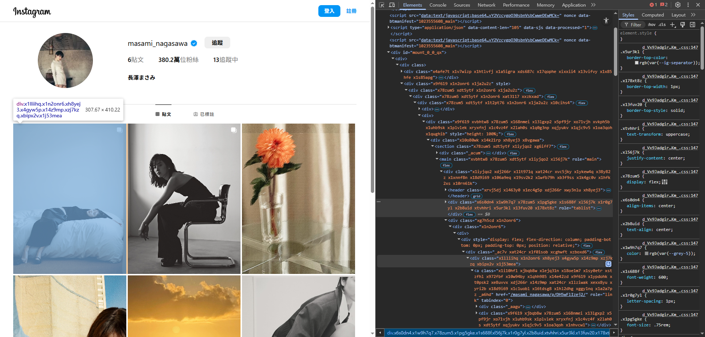
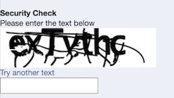

# 反爬蟲機制 Anti-Scraping Protection

## 前言

本文整理了在研究爬蟲 Facebook 與 Instagram 過程時的經驗，歸納出 Meta 採用的幾種反爬蟲方法。

<!-- more -->

## 限制

任何自動化網頁操作工具（例如：Selenium、Katalon、Puppeteer，以下簡稱「自動化工具」）都能模仿使用者合法地操作網頁，我們不可能 100% 阻擋爬蟲，反爬蟲機制也可能影響使用者體驗，因此開發者必須在兩者之間做出權衡。

## 方法

### 前端

#### 混淆 CSS 名稱

雜湊生成 CSS class 名稱，讓爬蟲更難查出原始語意。例如，在 source code 中的 `instagram-header-bottom-border` 會被轉換成類似 `x9f619` 的名稱。Meta 甚至還在網頁中隨機插入無意義的 `<div>` 或 `<span>` 干擾爬蟲使用 XPath 抓取頁面元素。

這種技術的本意是縮小 CSS 的檔案大小，並解決 CSS 命名衝突的問題。但它同時也降低了程式碼的可讀性，提高了爬蟲解析頁面的難度。

Meta 使用自家開源的 [StyleX](https://stylexjs.com/) 來達成這個效果。



#### 動態載入資料

載入頁面時，不載入全部內容，而是在瀏覽器執行 JavaScript 後再向後端請求資料並渲染到畫面。但可能不利於 SEO。

#### 強制登入檢查

強制使用者登入才能瀏覽網站，可以用無法關閉的燈箱或自動轉跳登入頁面的方式來實作。

如果使用者一進入網站就強制登入，可能還滿影響使用者體驗的。常見的做法是，讓使用者先瀏覽了部分頁面資訊後，才進行強制登入檢查。

Facebook 藉由動態載入資料加上強制登入檢查，等使用者瀏覽了幾篇貼文後，才顯示無法關閉的登入燈箱。維持了一定使用者體驗的同時，也限制自動化工具只能爬取少部分的網站資料。

### 後端

#### IP 限流

根據 IP Address 做 Rate Limiting。

可以透過 NGINX 等 reverse proxy 管理 traffic。雖然爬蟲者可以購買大量的 Proxy IP（通常是 Residential Proxy）來規避限制，但這樣做會大幅提高成本，具有一定程度的嚇阻效果。

#### Cursor-based pagination API

傳統我們使用「頁碼」或「Offset」作為 pagination 的依據，但這樣的設計可預測性高，容易被爬蟲反查出資料結構。

```
GET /products?pageSize=10&currentPage=2
```

Facebook 使用 cursor-based pagination 來查詢資料，每一個游標都代表查詢結果中某個資料的位置，前端必須透過這個游標才能請求下一頁的內容。

```
GET /products?pageSize=10&cursor=Cg8Ob3JnYW5pbWUiOiAiMjAyNC0wNi0w
```

`cursor` 是一個隨機的 text string，指向某筆資料。在每一次的請求中，caller 附帶 `cursor` 參數：

- **第一次請求**：前端不需要帶游標參數。後端會直接查詢第一頁的資料，並在 response 中附帶一個游標。
- **第二頁之後的請求**：前端收到第一頁資料後，從 response 中取得 cursor，並在下一次請求中附帶該參數。後端根據這個游標決定下一頁的查詢邊界。

缺點是 caller 無法快速跳到特定頁碼，不適合有做「分頁選單」的 use case。

#### Media Expiry Time

為 image 和 video 等 media resource 的 URL 加上過期機制。

每次 caller 存取 media resource 時，server 端產生一個包含過期時間的加密 URL，可以藉由 JWT 或 token-based 來實作。

雖然任何 media 一旦公開到網路上，就一定可以被爬蟲以某種形式儲存下來。但這個策略的主要目的是提高爬蟲儲存 media resource 的成本。

在未加上過期機制之前，爬蟲只須儲存 media 的 URL 字串，但只要加上有效期限後，爬蟲就得考慮下載 media 的問題，否則 URL 過期後就無法再存取，進而迫使爬蟲面臨 storage 的費用問題。

以下是 Instagram 某張已經過期的圖片 URL，點進去可以發現 server 回傳錯誤訊息 `URL signature expired`：

```
https://scontent-man2-1.cdninstagram.com/v/t51.2885-19/500706091_18501100171035533_6758879803321435229_n.jpg?stp=dst-jpg_s150x150_tt6&_nc_ht=scontent-man2-1.cdninstagram.com&_nc_cat=105&_nc_oc=Q6cZ2QG3mLuuqHm1ot5_JvBSQ_NzeVjh1Nw_vQhyjfZ5YzXFcRwFEtZBULBhgNS8T5GkVrk&_nc_ohc=zc8HrRbVjTsQ7kNvwFiMImn&_nc_gid=-wCggBTfZf1PINz0cKornQ&edm=APs17CUBAAAA&ccb=7-5&oh=00_AfILhIYt99uHfiDLcUm8tIiKn5zA77457mO5puLZAE1byg&oe=68392289&_nc_sid=10d13b
```

#### Unclear Server Error Log

提供不明確的錯誤訊息。

這聽起來頗違反常見的 API 設計原則，可能降低開發者體驗，通常是資安考量，不要洩露後端內部過於細節的錯誤訊息，同時也讓爬蟲不好掌握他們請求失敗的確切原因，進而提高破解門檻。

以下是從 Facebook 貼文 API 的 response 中擷取的錯誤訊息，從 `errors` 內容推測，API 提供一個 `mid`（應該是指 messageId），並在 message 中告訴我們查 server logs 才能瞭解錯誤原因：

```json
{
  "errors": [
    {
      "message": "A server error field_exception occured. Check server logs for details.",
      "severity": "ERROR",
      "mids": [
        "8e8f9290d5fb45537defa9135b8d0254"
      ],
      "path": [
        "node",
        "timeline_list_feed_units",
        "edges"
      ]
    }
  ]
}
```

#### 檢查 HTTP Request 資訊

檢查 HTTP request header 的 `User-Agent` / `Referer` 等資料，不過這屬於較初階的阻擋方式，很容易就被爬蟲模仿。

#### CAPTCHA

CAPTCHA（Completely Automated Public Turing test to tell Computers and Humans Apart）是一種檢查使用者是否為真人的機制，最常見的類型就是顯示一張包含可讀性低文字的圖片，要求我們輸入圖片中的文字內容。



當然，如果每次使用者瀏覽網站時都觸發 CAPTCHA，一定會大幅影響使用者體驗，因此這些科技巨頭會根據多種指標決定是否顯示 CAPTCHA。

常見的指標包含：

**追蹤使用者的操作模式**

- 異常快速或過於規律的點擊行為、滑鼠游標的完美的移動軌跡。
- 載入頁面後，沒有滾動頁面、停留太少時間或缺乏必要操作。

**讀取使用者設備以及瀏覽器指紋（Browser fingerprinting）**

蒐集你所使用裝置的各種資訊，包含 IP Address、作業系統、螢幕解析度、音訊資料等，組合成一個獨一無二的 fingerprint（可以理解成一組 unique ID）。

使用自動化工具瀏覽網頁時，就容易在 fingerprint 中出現機器人才有的資訊。

**檢查 Navigator**

Navigator 是前端用來存取使用者的瀏覽器資訊的 API。

正常瀏覽器的 Navigator 會包含一些標準、完整的屬性，但自動化工具的屬性值可能不太相同，或是有缺少、刪除某些資料的情況。

**偵測 Chrome DevTools Protocol（CDP）**

CDP 是一種操作瀏覽器開發者工具的協定。例如，透過 Selenium 設定 cookie 時就使用到了 CDP。

**IP Address**

短時間內收到相同 IP Address 的大量請求。

---

觸發 CAPTCHA 的指標與機制非常複雜，因此爬蟲者很難有一個清楚的 roadmap 去破解。

如果想破解，常見的解決方案如下：

**模擬人類行為，避免觸發 CAPTCHA**

模擬人類正常操作網頁時會出現的行為，例如滑鼠的不規則移動。但是 CAPTCHA 通常會結合多種指標決定是否觸發，因此難以只靠這點就破解。

**自行開發辨識 CAPTCHA 演算法**

有些 CAPTCHA 需要使用者做出一些可預測性低的操作，例如滑動、拖曳或點擊隨機/特定位置，這種檢查方式讓你光是蒐集條件資料就很不容易。

而且產生 CAPTCHA 的演算法本身就是為了防止機器識別，反爬蟲方會加入一些干擾因素，要自行開發破解演算法相當困難。

**使用機器學習自動分析 CAPTCHA**

資料蒐集困難，模型訓練難度與成本高。

**購買人工破解服務（例如：[2Captcha](https://2captcha.com/)）**

將 CAPTCHA 頁面 redirect 給有輪班人員處理的第三方服務，交由在世界各地的工人智慧來手動破解。但可能有資料外洩與隱私的風險，且可控性低。成本較低，是較可行的方案。

## 結論

CAPTCHA 是反爬蟲機制中相對有效的一種工具，但反爬蟲機制不是只能使用一種。我們從 Meta 的策略中，可以觀察到他們結合了不同等級、層面的機制，在各個階段有效防堵爬蟲行為。

## 延伸閱讀

- [Turnstile | CAPTCHA 替代方案](https://www.cloudflare.com/products/turnstile/)
